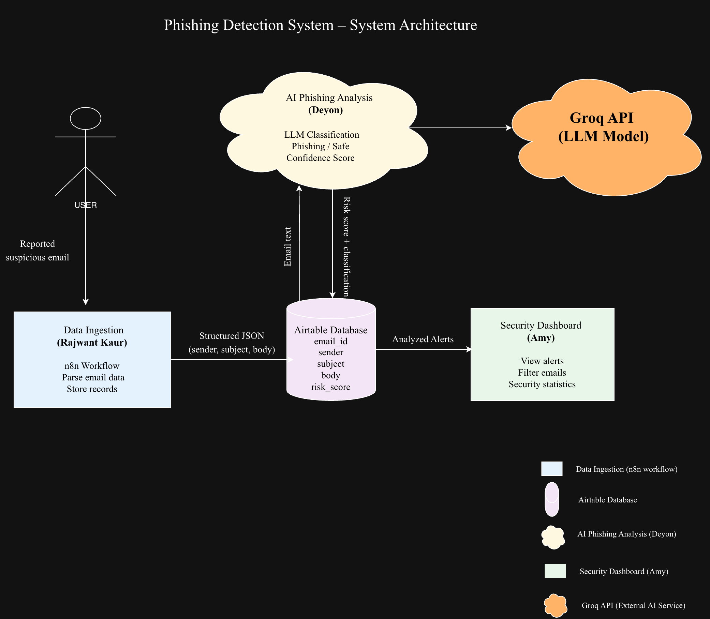

# Phishing Detection System

## Team Members

| Name         | Role/Component                   | GitHub Username |
| ------------ | -------------------------------- | --------------- |
| Rajwant Kaur | Data Ingestion                   | @rajwant11      |
| Deyon        | AI Phishing Analysis             | @Randinu-W      |
| Amy          | Security Dashboard / Integration | @amyag0730      |

---

## Problem Statement

Phishing emails are one of the most common cybersecurity threats today. Many users struggle to determine whether an email is legitimate or a phishing attempt, which can lead to stolen credentials, financial loss, or malware infections. Currently, users rely on manual inspection or simple spam filters, which are often inaccurate or inconsistent. This project aims to build an AI-powered phishing detection system that analyzes suspicious emails and classifies them as phishing or safe.

---

## Target Users

The primary users of this system are individuals and small organizations who frequently receive suspicious emails and need a simple way to analyze potential phishing threats. The system can also be useful for students learning about cybersecurity and email threat analysis.

---

## Architecture

---

## Component Breakdown

### Component 1: Data Ingestion (Owner: Rajwant Kaur)

* **Description:** Collect suspicious emails reported by users and convert the email content into structured data for analysis.
* **Tools:** n8n, Airtable
* **Input:** Reported suspicious email containing sender, subject, and email body
* **Output:** Structured JSON stored in Airtable
* **Standalone demo:** Submit a suspicious email and confirm that the structured email data appears in the Airtable database.

---

### Component 2: AI Phishing Analysis (Owner: Deyon)

* **Description:** Analyze email content using an AI model to determine whether the message is phishing or legitimate.
* **Tools:** Groq API, Large Language Model (LLM)
* **Input:** Email text retrieved from the Airtable database
* **Output:** Classification result (phishing or safe) and a confidence score
* **Standalone demo:** Run the AI model on a sample email and display the phishing classification result.

---

### Component 3: Security Dashboard (Owner: Amy)

* **Description:** Display analyzed phishing alerts and allow users to view results through a simple dashboard interface.
* **Tools:** Airtable dashboard, n8n integration
* **Input:** Classified email results from the database
* **Output:** Dashboard showing phishing alerts, filtered results, and statistics
* **Standalone demo:** View analyzed phishing alerts through the dashboard interface.

---

## Data Sources

* **Primary data:** User-reported suspicious emails submitted to the system.
* **Sample data:** Example phishing emails and legitimate emails used for testing during development.
* **Data format:** JSON records stored in Airtable containing sender, subject, body, and risk_score.

---

## AI Capabilities

| Capability          | Purpose                                       | Model/API |
| ------------------- | --------------------------------------------- | --------- |
| Text Classification | Identify whether an email is phishing or safe | Groq LLM  |
| Confidence Scoring  | Provide probability score for phishing risk   | Groq LLM  |

---

## Success Criteria

1. The system correctly classifies at least 8 out of 10 test emails as phishing or safe.
2. The data pipeline processes incoming email data within a few seconds.
3. The dashboard displays all analyzed records with correct classification results.
4. All system components integrate and exchange data correctly.
5. Each component includes documentation explaining setup and usage.

---

## Timeline

| Week    | Milestone                                                   |
| ------- | ----------------------------------------------------------- |
| 3 (Now) | Project proposal + architecture diagram + GitHub repository |
| 4-6     | Build individual components and test with sample data       |
| 7-9     | Add AI capabilities and refine analysis                     |
| 10-12   | Integrate components and build dashboard                    |
| 13-14   | Final testing and documentation                             |
| 15      | Final presentation                                          |
